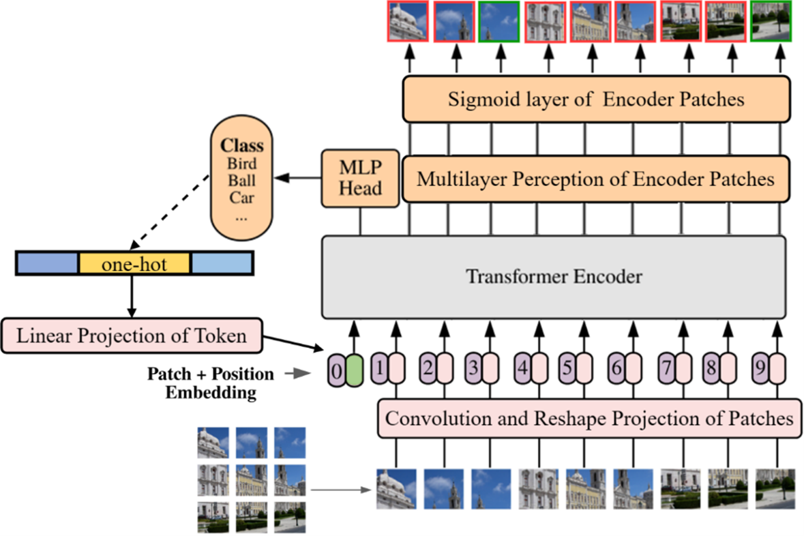

## 📂毕设信息
```python
# author: pengpenglang
# language: pytorch
# data: 2023-5-25
# description: 基于ImageNet数据集的目标分类与定位任务联合优化
```
## 📝任务描述
- 视觉任务: 单目标分类与定位任务联合优化
- 设计思路: 模拟人眼的注意力机制并利用两个任务视觉特征分布上的相似性建立联合优化模型
- 具体做法: 通过联合训练通用特征提取器增强视觉特征能力并引入提示学习动态完成多个任务

## 📚模型架构


## 文件说明
```bash
./
├── images              # 存放生成的所有图像
├── logs                # 存放analysis.py生成的tensorboard日志
├── model
│   └── vit_model.py    # 模型结构定义
├── weights             # 存放训练出来的权重文件
├── runs                # 存放训练的tensorboard日志
├── run.sh              # 执行训练的shell脚本
├── utils
│   ├── box.py          # 与生成的定位框有关的函数
│   ├── data.py         # 数据集加载函数
│   ├── draw.py         # 可视化绘制函数
│   ├── evaluate.py     # 验证过程用到的mAP等指标计算函数
│   ├── loss.py         # 自定义损失函数
│   ├── train_epoch.py  # 每轮训练函数
│   └── visualize.py    # 不用管
├── predict.py          # 模型单张图像预测(不支持调整batch_size)
├── analyse.py          # 模型分析
├── test.py             # 模型指标评测
├── test_box.py         # 模型定位框评测(不支持调整batch_size)
├── train.py            # 模型训练
├── transfer.py         # 迁移学习训练
└── README.md
````
## 运行方法
```bash
git clone git@github.com:pengpenglang/PromptToken-ViT.git
cd PromptToken-ViT
pip install -r requirements.txt
bash run.sh train.py   # 运行训练脚本
```

## 相关文件
- [PPT在线查看](https://www.canva.cn/design/DAFjngSSw-4/NuFrB6opqQzES74DWigaZQ/edit?utm_content=DAFjngSSw-4&utm_campaign=designshare&utm_medium=link2&utm_source=sharebutton)
- [文档&权重文件](https://pan.baidu.com/s/1oF88oYn44TAGrdj5fB1ARw?pwd=9cx7)